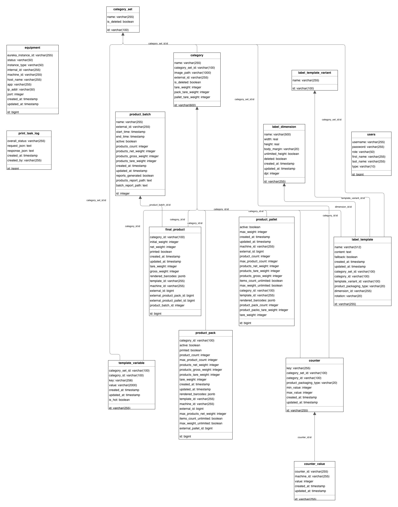

# Triel Pro Co Database Documentation

This document describes the database schema for the Triel Pro Co system. 

Database engine: `PostgreSQL`

## Database Diagram

## Core Entities

### users
Stores user information and authentication details.
- `id`: Internal unique identifier (Long).
- `username`: Unique username for login.
- `password`: Hashed password.
- `first_name`, `last_name`: User's name.
- `role`: User role (e.g., ADMIN, WORKER).
- `is_active`: Flag indicating if the user account is active.

### category
Defines product categories and their default settings.
- `id`: Unique identifier (UUID String).
- `category_set_id`: Reference to the `category_set`.
- `name`: Category name.
- `image_path`: Path to the category icon/image.
- `external_id`: Identifier from external systems.
- `tare_weight`: Default tare weight for the product.
- `pack_tare_weight`: Default tare weight for the pack.
- `pallet_tare_weight`: Default tare weight for the pallet.
- `is_deleted`: Soft delete flag.

### category_set
Groups categories together.
- `id`: Unique identifier (UUID String).
- `name`: Name of the set.
- `is_deleted`: Soft delete flag.

## Labeling & Printing

### label_template
Stores label designs and their associations.
- `id`: Unique identifier (UUID String).
- `category_set_id`: Optional reference to a `category_set`.
- `category_id`: Optional reference to a `category`.
- `template_variant_id`: Reference to the `label_template_variant`.
- `dimension_id`: Reference to the `label_dimension`.
- `name`: Template name.
- `content`: Design content (usually JSON or XML).
- `fallback`: Flag indicating if this is a fallback template.
- `product_packaging_type`: Type of packaging (SINGLE_PRODUCT, PACK, PALLET).
- `rotation`: Design rotation (0, 90, 180, 270).
- `created_at`, `updated_at`: Audit timestamps.

### label_template_variant
Defines specific variants of a template.
- `id`: Unique identifier (String).
- `name`: Variant name.

### label_dimension
Physical dimensions of labels.
- `id`: Unique identifier (String).
- `width`: Label width in mm.
- `height`: Label height in mm.

### template_variable
Dynamic variables used within label designs.
- `id`: Unique identifier (UUID String).
- `category_set_id`: Optional reference to a `category_set`.
- `category_id`: Optional reference to a `category`.
- `key`: Variable name (e.g., `EXPIRY_DATE`).
- `value`: Static value or formula.
- `is_hot`: Flag for variables that are frequently updated.

### counter
Defines sequential counters.
- `id`: Unique identifier (UUID String).
- `key`: Counter key.
- `category_set_id`, `category_id`: Optional scoping.
- `product_packaging_type`: Packaging type associated with the counter.
- `min_value`, `max_value`: Counter range.

### counter_value
Current state of a counter for a specific machine.
- `id`: Unique identifier (UUID String).
- `counter_id`: Reference to the `counter`.
- `machine_id`: Identifier of the machine using this counter.
- `value`: Current counter value.

### print_task_log
Execution logs for print operations.
- `id`: Unique identifier (Long).
- `machine_id`: ID of the machine that performed printing.
- `status`: Operation status (SUCCESS, ERROR).
- `data`: JSONB field with task details and results.
- `created_at`: Log timestamp.

## Production Data

All production data tables (`final_product`, `product_pack`, `product_pallet`) include common fields from a base product definition:
- `machine_id`: ID of the machine that produced the item.
- `category_id`, `template_id`: Identifiers of the category and template used at the time of production.
- `created_at`, `updated_at`: Production and modification timestamps.
- `rendered_barcodes`: JSONB field containing generated barcode data.

### product_batch
Represents a production run/batch.
- `id`: Internal unique identifier (Integer).
- `name`: Batch name.
- `external_id`: Unique identifier from external systems.
- `start_time`, `end_time`: Batch duration.
- `active`: Flag indicating the currently active batch.
- `products_count`: Total number of products in the batch.
- `products_net_weight`, `products_gross_weight`, `products_tare_weight`: Aggregated weights.

### product_pallet
Represents a shipping or storage pallet.
- `id`: Internal unique identifier (Long).
- `external_id`: Identifier from external systems.
- `active`: Flag indicating if the pallet is currently being filled.
- `max_weight`, `max_product_count`: Limits for the pallet.
- `product_count`, `product_pack_count`: Current counts.
- `products_net_weight`, `products_gross_weight`, `products_tare_weight`: Aggregated product weights.
- `product_packs_tare_weight`: Total weight of packs on the pallet.
- `tare_weight`: Weight of the pallet itself.

### product_pack
Represents a package of products.
- `id`: Internal unique identifier (Long).
- `external_id`: Identifier from external systems.
- `external_pallet_id`: Reference to the parent pallet.
- `active`: Flag indicating if the pack is currently being filled.
- `product_count`, `max_product_count`: Current and max number of items.
- `products_net_weight`, `products_gross_weight`, `products_tare_weight`: Aggregated item weights.
- `tare_weight`: Weight of the package itself.
- `printed`: Flag indicating if the pack label was printed.

### final_product
Individual labeled products.
- `id`: Internal unique identifier (Long).
- `external_id`: Identifier from external systems.
- `external_product_pack_id`: Reference to the parent pack.
- `external_product_pallet_id`: Reference to the parent pallet.
- `product_batch_id`: Reference to the `product_batch`.
- `initial_weight`: Weight before processing.
- `net_weight`, `gross_weight`, `tare_weight`: Recorded weights.
- `printed`: Flag indicating if the label was printed.

## System

### equipment
Registry of hardware instances and their status.
- `id`: Unique identifier (Long).
- `eureka_instance_id`: Unique ID from Eureka discovery.
- `status`: Instance status (UP, DOWN, etc.).
- `instance_type`: Type of equipment (e.g., LABEL_APPLICATOR, CONVEYOR).
- `internal_id`: Internal equipment identifier.
- `machine_id`: Logical machine ID.
- `host_name`, `ip_addr`, `port`: Network information.

## Key Relationships

- **Categorization**: `category` and `label_template` are organized into `category_set` groups.
- **Labeling Hierarchy**: `label_template` links to `label_dimension` for physical sizing and `label_template_variant` for specific design variations.
- **Production Hierarchy**:
    - `product_batch` (Top level)
    - `product_pallet` (Contains packs or products)
    - `product_pack` (Contains products, belongs to a pallet)
    - `final_product` (Leaf level, links to batch, pack, and pallet)
- **Counters**: `counter_value` tracks the state of a `counter` per machine.
