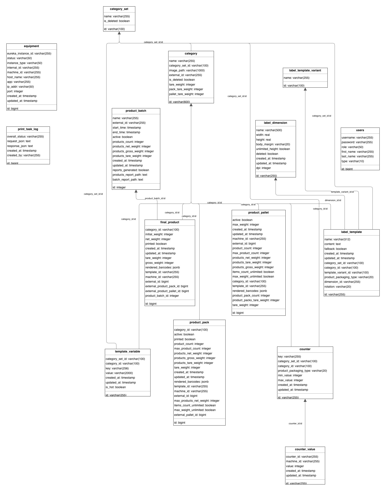

# Документация схемы базы данных Triel Pro Co

В данном документе приведено описание схемы базы данных системы Triel Pro Co.

СУБД: `PostgreSQL`

## Диаграмма базы данных

## Основные сущности

### users (Пользователи)
Хранит информацию о пользователях и данные для аутентификации.
- `id`: Внутренний уникальный идентификатор (Long).
- `username`: Уникальное имя пользователя для входа в систему.
- `password`: Хэшированный пароль.
- `first_name`, `last_name`: Имя и фамилия пользователя.
- `role`: Роль пользователя (например, ADMIN, WORKER).
- `is_active`: Флаг, указывающий, активна ли учетная запись.

### category (Категория)
Определяет категории продуктов и их настройки по умолчанию.
- `id`: Уникальный идентификатор (UUID String).
- `category_set_id`: Ссылка на `category_set`.
- `name`: Название категории.
- `image_path`: Путь к иконке/изображению категории.
- `external_id`: Идентификатор из внешних систем.
- `tare_weight`: Вес тары продукта по умолчанию.
- `pack_tare_weight`: Вес тары упаковки по умолчанию.
- `pallet_tare_weight`: Вес тары паллеты по умолчанию.
- `ignore_product_out_of_weight_range`: Если `true`, аппликатор отбраковывает продукты, масса нетто которых вне диапазона [`product_min_weight`, `product_max_weight`].
- `product_min_weight`: Минимальная допустимая масса нетто продукта, граммы.
- `product_max_weight`: Максимальная допустимая масса нетто продукта, граммы.
- `is_deleted`: Флаг мягкого удаления.

### category_set (Набор категорий)
Группирует категории.
- `id`: Уникальный идентификатор (UUID String).
- `name`: Название набора.
- `is_deleted`: Флаг мягкого удаления.

## Маркировка и печать

### label_template (Шаблон этикетки)
Хранит дизайны этикеток и их ассоциации.
- `id`: Уникальный идентификатор (UUID String).
- `category_set_id`: Опциональная ссылка на `category_set`.
- `category_id`: Опциональная ссылка на `category`.
- `template_variant_id`: Ссылка на `label_template_variant`.
- `dimension_id`: Ссылка на `label_dimension`.
- `name`: Название шаблона.
- `content`: Содержимое дизайна (обычно JSON или XML).
- `fallback`: Флаг, указывающий, является ли этот шаблон резервным (по умолчанию).
- `product_packaging_type`: Тип упаковки (SINGLE_PRODUCT, PACK, PALLET).
- `rotation`: Поворот дизайна (0, 90, 180, 270).
- `created_at`, `updated_at`: Временные метки аудита.

### label_template_variant (Вариант шаблона этикетки)
Определяет конкретные варианты шаблона.
- `id`: Уникальный идентификатор (String).
- `name`: Название варианта.

### label_dimension (Размер этикетки)
Физические размеры этикеток.
- `id`: Уникальный идентификатор (String).
- `width`: Ширина этикетки в мм.
- `height`: Высота этикетки в мм.

### template_variable (Переменная шаблона)
Динамические переменные, используемые в дизайнах этикеток.
- `id`: Уникальный идентификатор (UUID String).
- `category_set_id`: Опциональная ссылка на `category_set`.
- `category_id`: Опциональная ссылка на `category`.
- `key`: Имя переменной (например, `EXPIRY_DATE`).
- `value`: Статическое значение или формула.
- `is_hot`: Флаг для переменных, которые часто обновляются.

### counter (Счетчик)
Определяет последовательные счетчики.
- `id`: Уникальный идентификатор (UUID String).
- `key`: Ключ счетчика.
- `category_set_id`, `category_id`: Опциональная привязка к области видимости.
- `product_packaging_type`: Тип упаковки, связанный со счетчиком.
- `min_value`, `max_value`: Диапазон счетчика.

### counter_value (Значение счетчика)
Текущее состояние счетчика для конкретной машины.
- `id`: Уникальный идентификатор (UUID String).
- `counter_id`: Ссылка на `counter`.
- `machine_id`: Идентификатор машины, использующей этот счетчик.
- `value`: Текущее значение счетчика.

### unique_code (Уникальный код)
Пул уникальных кодов (например, DataMatrix), загруженных в систему для последующей печати.
- `id`: Уникальный идентификатор (UUID String).
- `category_id`: Ссылка на `category`.
- `code`: Само значение кода.
- `created_at`: Временная метка загрузки кода.
- `created_by`: Пользователь, загрузивший код.
- `reserved`: Флаг, указывающий, зарезервирован ли код для печати.
- `reserved_by`: Идентификатор процесса или машины, зарезервировавшей код.
- `reserved_at`: Время резервирования.
- `parts`: JSONB поле с разобранными частями кода (GTIN, серийный номер и т.д.).

### printed_unique_code (Напечатанный уникальный код)
Реестр кодов, которые были фактически напечатаны на продукции.
- `id`: Уникальный идентификатор.
- `code`: Значение кода (индексировано для быстрого поиска).
- `category_id`: Ссылка на `category`.
- `external_product_id`: Ссылка на произведенный продукт (external_id из `final_product`).
- `machine_id`: ID машины, выполнившей печать.
- `validated`: Флаг, указывающий, был ли код успешно верифицирован сканером после печати.
- `source_code_deleted`: Флаг, указывающий, был ли исходный код удален из таблицы `unique_code` после использования.
- `created_at`, `created_by`: Временные метки и автор записи.
- `reserved`, `reserved_by`, `reserved_at`: Информация о резервировании при печати.
- `printed_at`: Временная метка фактической печати.

### print_task_log (Лог задач печати)
Логи выполнения операций печати.
- `id`: Уникальный идентификатор (Long).
- `machine_id`: ID машины, выполнившей печать.
- `status`: Статус операции (SUCCESS, ERROR).
- `data`: Поле JSONB с деталями задачи и результатами.
- `created_at`: Временная метка лога.

## Производственные данные

Все таблицы производственных данных (`final_product`, `product_pack`, `product_pallet`) включают общие поля из базового определения продукта:
- `machine_id`: ID машины, произведшей единицу товара.
- `category_id`, `template_id`: Идентификаторы категории и шаблона, использованных в момент производства.
- `created_at`, `updated_at`: Временные метки производства и изменения.
- `rendered_barcodes`: Поле JSONB, содержащее сгенерированные данные штрих-кодов.

### product_batch (Партия продукции)
Представляет производственный цикл/партию.
- `id`: Внутренний уникальный идентификатор (Integer).
- `name`: Название партии. Уникально глобально среди всех партий, включая закрытые. В схеме допускает NULL для исторических записей, но обязательно на уровне API.
- `external_id`: Идентификатор из внешних систем. Уникален глобально среди всех партий, включая закрытые. В схеме допускает NULL для исторических записей, но обязателен на уровне API.
- `start_time`, `end_time`: Время начала и окончания партии.
- `active`: Флаг активной партии. **Одновременно может быть активно несколько партий** — по одной на производственную линию. Каждая панель аппликатора выбирает, в какую активную партию она производит.
- `products_count`: Общее количество продуктов в партии.
- `products_net_weight`, `products_gross_weight`, `products_tare_weight`: Агрегированные веса, пересчитываются по записям `final_product` с этим id партии.
- `reports_generated`, `products_report_path`, `batch_report_path`: CSV-отчёты, формируемые при закрытии партии.

### product_pallet (Паллета продукции)
Представляет транспортную или складскую паллету.
- `id`: Внутренний уникальный идентификатор (Long).
- `external_id`: Идентификатор из внешних систем.
- `active`: Флаг, указывающий, заполняется ли паллета в данный момент.
- `max_weight`, `max_product_count`: Лимиты для паллеты.
- `product_count`, `product_pack_count`: Текущее количество продуктов и упаковок.
- `products_net_weight`, `products_gross_weight`, `products_tare_weight`: Агрегированные веса продуктов.
- `product_packs_tare_weight`: Общий вес упаковок на паллете.
- `tare_weight`: Вес самой паллеты.

### product_pack (Упаковка продукции)
Представляет упаковку продуктов.
- `id`: Внутренний уникальный идентификатор (Long).
- `external_id`: Идентификатор из внешних систем.
- `external_pallet_id`: Ссылка на родительскую паллету.
- `active`: Флаг, указывающий, заполняется ли упаковка в данный момент.
- `product_count`, `max_product_count`: Текущее и максимальное количество единиц товара.
- `products_net_weight`, `products_gross_weight`, `products_tare_weight`: Агрегированные веса единиц товара.
- `tare_weight`: Вес самой упаковки.
- `printed`: Флаг, указывающий, была ли напечатана этикетка упаковки.

### final_product (Конечный продукт)
Индивидуальные промаркированные продукты.
- `id`: Внутренний уникальный идентификатор (Long).
- `external_id`: Идентификатор из внешних систем.
- `external_product_pack_id`: Ссылка на родительскую упаковку.
- `external_product_pallet_id`: Ссылка на родительскую паллету.
- `product_batch_id`: Ссылка на `product_batch`.
- `initial_weight`: Вес до обработки.
- `net_weight`, `gross_weight`, `tare_weight`: Зафиксированные веса (нетто, брутто, тара).
- `printed`: Флаг, указывающий, была ли напечатана этикетка.

## Системные данные

### equipment (Оборудование)
Реестр экземпляров оборудования и их статус.
- `id`: Уникальный идентификатор (Long).
- `eureka_instance_id`: ID из Eureka discovery. Не уникальный — меняется, когда машина регистрируется с новым instance ID.
- `status`: Статус экземпляра (UP, DOWN и т.д.).
- `instance_type`: Тип оборудования (например, LABEL_APPLICATOR, CONVEYOR).
- `internal_id`: Внутренний идентификатор оборудования.
- `machine_id`: Логический ID машины. Уникальный и обязательный — ключ, по которому выполняется upsert оборудования; если экземпляр не сообщает machine ID, используется `eureka_instance_id`.
- `host_name`, `ip_addr`, `port`: Сетевая информация.

## Экспорт данных

### export_connection (Подключение для экспорта)
Подключения к целевым базам данных для экспорта.
- `id`: Уникальный идентификатор (UUID String).
- `name`: Уникальное название подключения.
- `db_type`: Тип целевой базы данных (POSTGRESQL, MYSQL, MSSQL, ORACLE).
- `host`, `port`, `database_name`: Расположение целевой базы данных.
- `username`, `password`: Учетные данные целевой базы данных.
- `properties`: Необязательные дополнительные параметры JDBC URL.
- `created_at`, `updated_at`: Временные метки аудита.

### export_task (Задача экспорта)
Определения запланированных задач экспорта данных.
- `id`: Уникальный идентификатор (UUID String).
- `name`: Уникальное название задачи.
- `connection_id`: Ссылка на `export_connection`.
- `source_table`: Имя исходной таблицы/представления, одно из заданных в `export.tables`.
- `target_table`: Имя таблицы в целевой базе данных, может включать схему. `NULL` для файловых целей.
- `delimiter`: Разделитель полей экспортируемого файла (COMMA, PIPE, TAB). Используется только файловыми целями.
- `file_mask`: Необязательный префикс имени файла; имя файла — маска плюс метка времени `yyMMddHHmmss`.
- `file_extension`: Расширение экспортируемого файла (TXT, CSV, PSV, TSV). По умолчанию — расширение разделителя.
- `start_header`: Необязательный маркер, записываемый первой ячейкой строки заголовков. Применяется только для экспорта в TXT; своего столбца данных не имеет, поэтому строки данных им не дополняются.
- `end_header`: Необязательный маркер, записываемый последней ячейкой строки заголовков. Применяется только для экспорта в TXT, как и `start_header`.
- `header_in_each_row`: Если `true`, строка заголовков повторяется перед каждой строкой данных. Применяется только для экспорта в TXT.
- `column_mappings`: JSONB-массив маппингов столбцов источника на столбцы цели.
- `cron_expression`: Cron-расписание Spring из 6 полей. `NULL` означает, что задача запускается только вручную и не выполняется по расписанию.
- `enabled`: Флаг, указывающий, запланирована ли задача.
- `last_exported_id`: Водяной знак экспорта — наибольший `id` исходной строки, который уже экспортирован.
- `created_at`, `updated_at`: Временные метки аудита.

### export_task_log (Лог задач экспорта)
История запусков задач экспорта.
- `id`: Уникальный идентификатор (Long).
- `task_id`: Ссылка на `export_task` (строки удаляются вместе с задачей).
- `status`: Статус запуска (SUCCESS, FAILED).
- `started_at`, `finished_at`: Длительность запуска.
- `rows_exported`: Количество строк, вставленных в целевую таблицу.
- `from_id`, `to_id`: Диапазон водяного знака, охваченный запуском.
- `error_message`: Детали ошибки, если есть.

## Ключевые связи

- **Категоризация**: `category` и `label_template` организованы в группы `category_set`.
- **Иерархия маркировки**: `label_template` ссылается на `label_dimension` для определения физического размера и на `label_template_variant` для конкретных вариаций дизайна.
- **Производственная иерархия**:
  - `product_batch` (Верхний уровень; одновременно может быть активно несколько партий, по одной на линию)
  - `product_pallet` (Содержит упаковки или продукты)
  - `product_pack` (Содержит продукты, принадлежит паллете)
  - `final_product` (Нижний уровень, ссылается на партию, упаковку и паллету)
- **Уникальные коды**:
  - `unique_code` хранит пул доступных кодов для категорий.
  - `printed_unique_code` связывает использованный код с конкретным продуктом (`final_product`).
- **Счетчики**: `counter_value` отслеживает состояние `counter` для каждой машины.
