## Маркировка продукта кодом GS1 DataMatrix

Штрих-код маркировки GS1 DataMatrix - штриховой двухмерный идентификатор, который применяется при обязательной маркировке товаров. Код маркировки товара формируется в государственных информационных системах маркировки товаров, таких как:

* ГИС «Электронный знак» (Республика Беларусь)
* ГИС МТ «Честный знак» (Российская Федерация)
* ГИС МТ e-Mark (Республика Армения)
* ИС МПТ «Tañba» (Республика Казахстан)
* Другие системы маркировки товаров

Коды маркировки можно загрузить с помощью файла, сгенерированного в системах маркировки товаров.

Для этого, нужно перейти во вкладку продукта `Продукты > Категории > Продукты > Коды маркировки продукта`

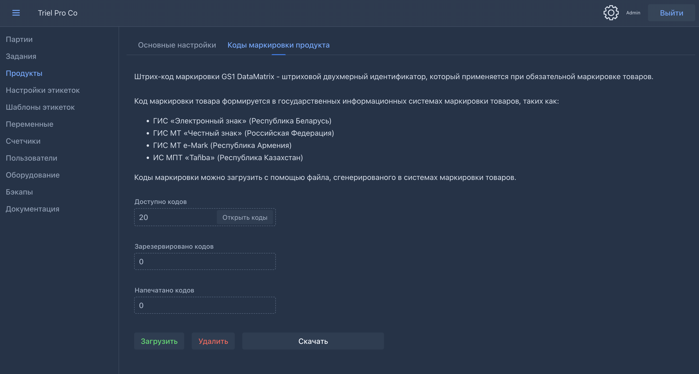

Далее нажать кнопку `Загрузить` и выбрать файл с кодами маркировки. Файл с кодами маркировки должен содержать валидные коды маркировки в формате GS1 DataMatrix.

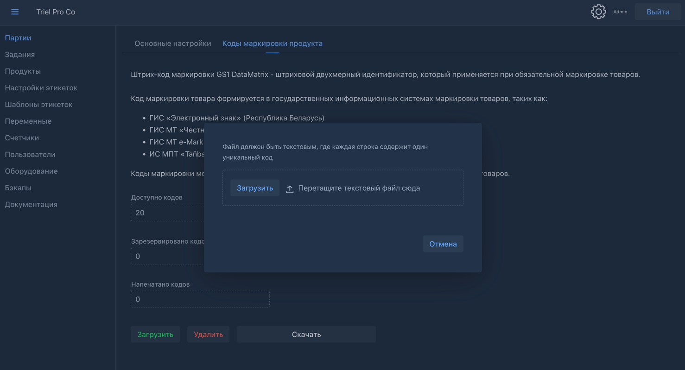

> Пример файла с кодами маркировки:

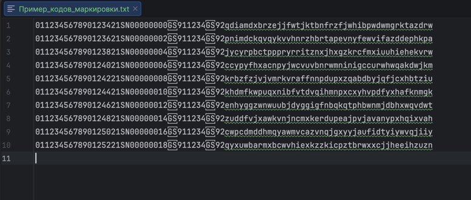

После загрузки кодов маркировки, они будут доступны для использования в системе маркировки товаров. Система автоматически валидирует загруженные коды и принимает только валидные.

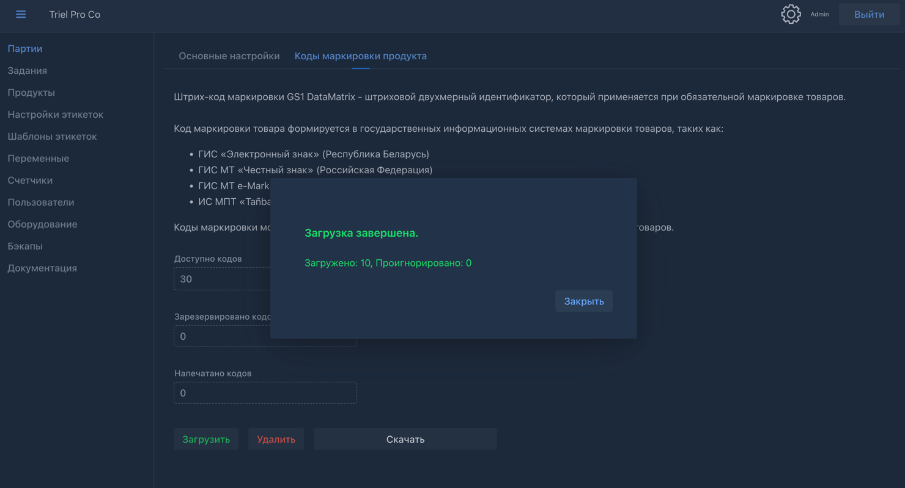

Загруженные коды можно просмотреть. Для этого нужно нажать кнопку `Открыть`, расположенную справа от кол-ва доступных кодов.

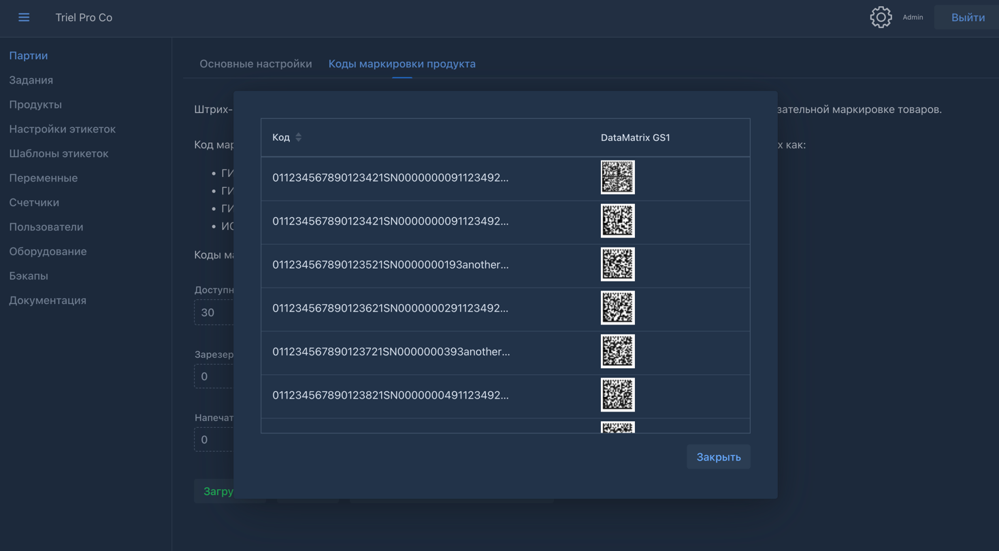

> В окне просмотра кодов отображается до 50 элементов.

На вкладке `Коды маркировки продукта` можно скачать распечатанные коды, а также удалить коды, которые не были распечатаны. Перед удалением, можно скачать нераспечатанные коды маркировки.

--- 

Для маркировки продукта, в шаблоне этикетки нужно вставить бар-код с типом `GS1 DataMatrix` и выбрать переменную `{{прод_код}}`.

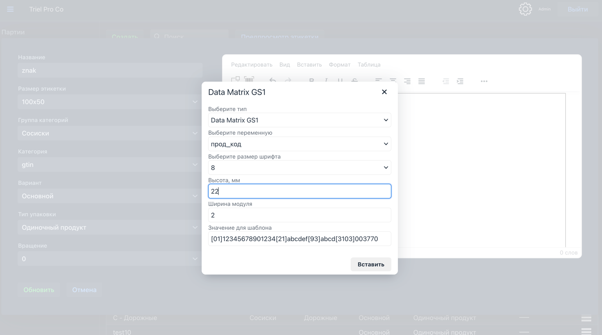
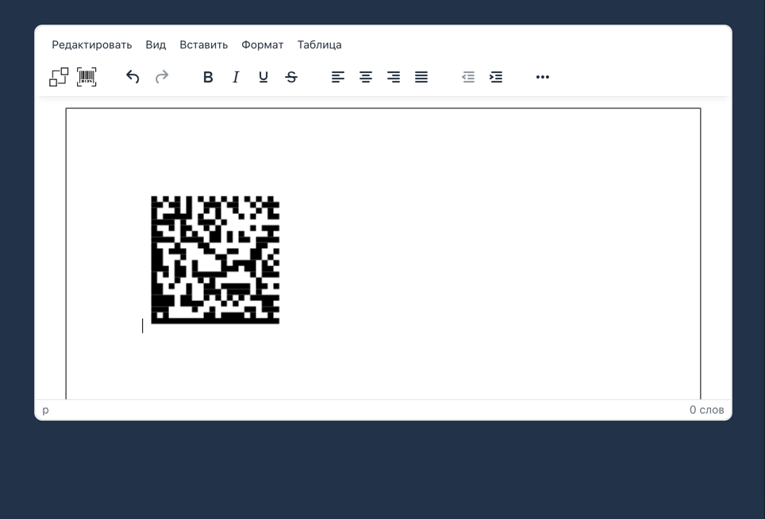

> Важно отметить, в редакторе этикетки, для визуального представления бар-кода GS1 DataMatrix, используется значение из поля `Значение для шаблона`.

В окне предпросмотра этикетки, можно увидеть, как будет выглядеть этикетка с вставленным бар-кодом GS1 DataMatrix.

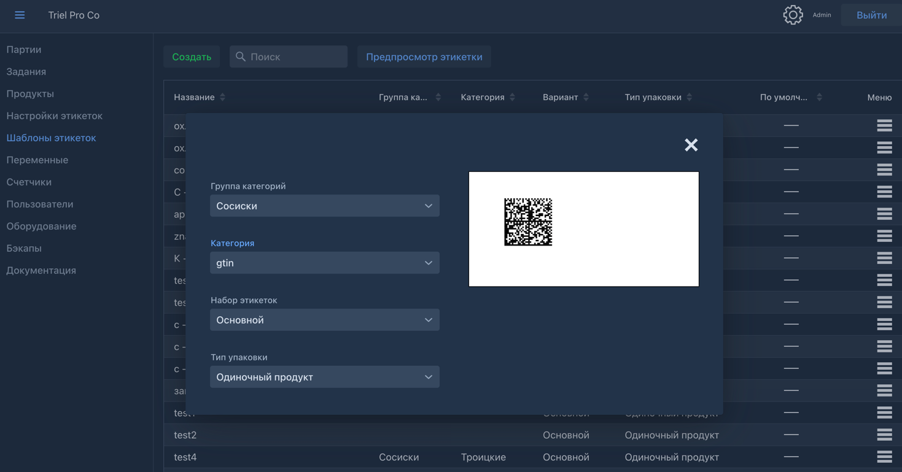

> Важно отметить, в предпросмотре этикетки, значение бар-кода берется из таблицы загруженных кодов, но код не помечается как использованный.
> Если для выбранного продукта коды еще не загружены, система сгенерирует рандомное значение.

Каждый распечатанный код маркировки присваивается продукту и доступен в отчетах.

### Маркировка продукта с переменным весом

Для добавления переменного веса в код GS1 DataMatrix, нужно добавить динамическую переменную, в состав которой будет включены уникальный код маркировки и вес продукта.

> Важно отметить, что сгенерированные коды для маркировки с переменным весом, отличаются от кодов для маркировки с фиксированным весом.
> Обычно, вместо идентификаторов применения (AI) [91] и [92] используется AI [93] (Код проверки).

Идентификатор применения `AI 3103` используется для указания веса продукта в маркировке. Для переменного веса используются 6 цифр.

На странице Переменных, нужно нажать кнопку `Создать` и определить, к какому продукту относится переменная.

Далее определить ключ переменно, например `код_вес` и сформировать значение как:

```
{{прод_код}}[3103]{{math "нетто_г" format="000000"}}
```
При генерации кода маркировки, система автоматически подставит вес продукта в формате 6 цифр.
Далее нужно обновить переменную для генерации бар-кода GS1 DataMatrix

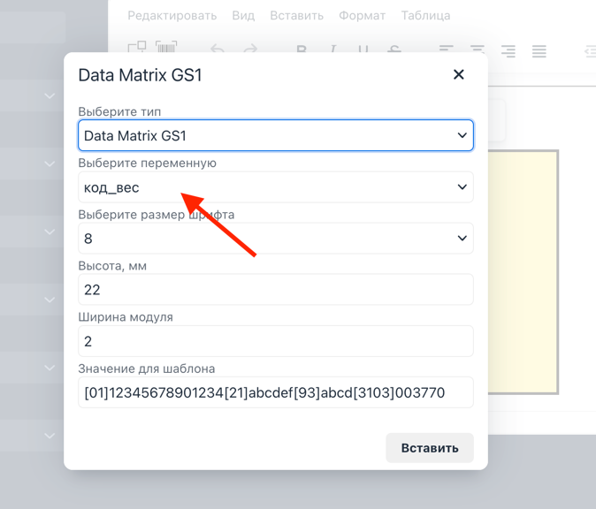

В окне предпросмотра, можно проверить, что вес продукта подставляется корректно.

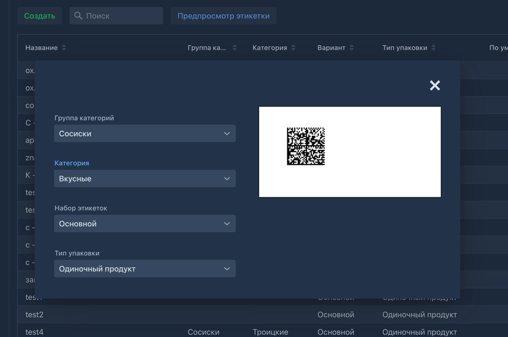

Для проверки генерации бар-кода GS1 DataMatrix можно использовать приложения для мобильных устройств, например `QRBot`.

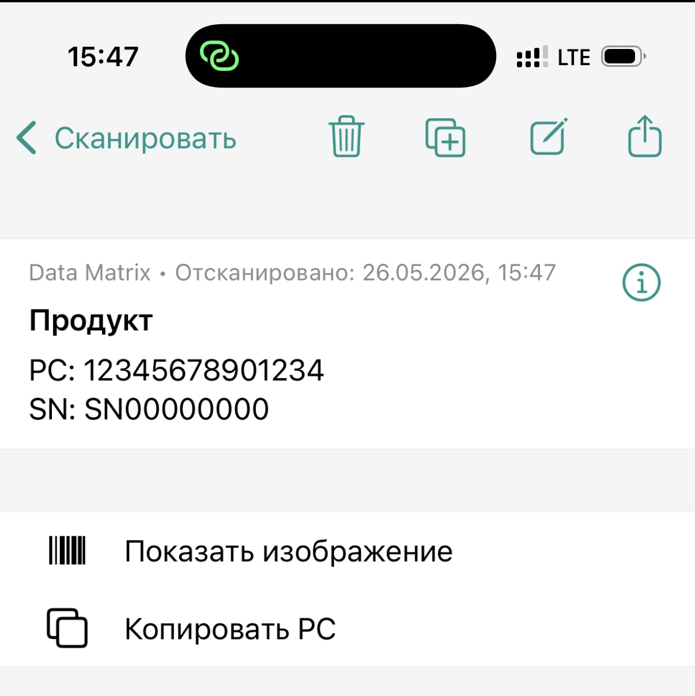
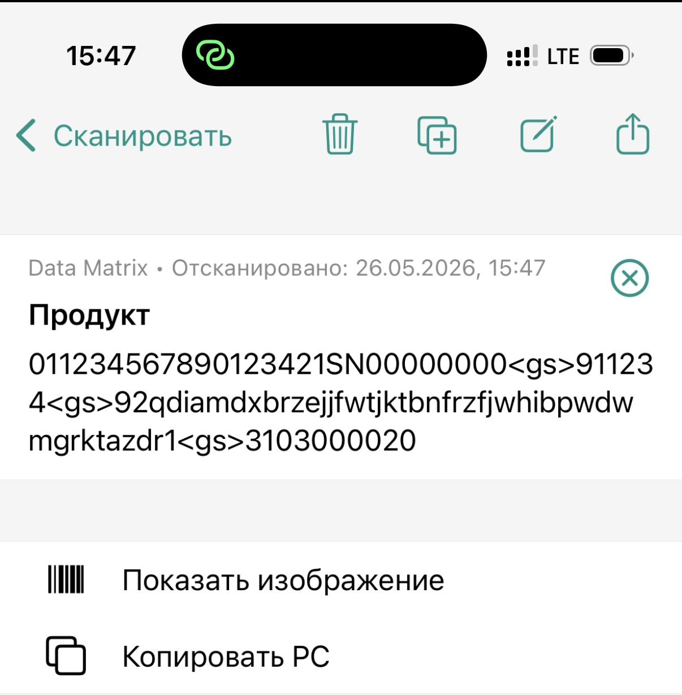

